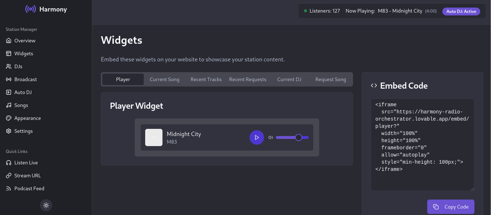

# Harmony Radio Manager

<div align="center">
  
</div>

## 📻 About

Harmony Radio Manager is a comprehensive web application for managing your internet radio station. Built with React, TypeScript, and Tailwind CSS, it provides everything you need to run a professional online radio station, from managing DJs to scheduling playlists and embedding widgets on your website.

## 🌟 Features

### Station Overview
Monitor your station's performance with real-time statistics including current listeners, now playing information, and daily analytics.

<div align="center">
  
</div>

### DJ Management
Add and manage DJs, set who is currently on air, and provide connection instructions for live broadcasts.

<div align="center">
  
</div>

### Auto DJ
Configure automatic music playback when no DJ is broadcasting live. Manage playlists, crossfade durations, and playback settings.

<div align="center">
  
</div>

### Embeddable Widgets
Easily embed customizable widgets on your website to showcase your station content, including:
- Player widget
- Current song display
- Recent tracks list
- Song request form
- Current DJ information
- Recent requests

Simply copy and paste the embed code to your website.

<div align="center">
  
</div>

## 🚀 Getting Started

### Prerequisites
- Node.js (v16 or later)
- npm or bun

### Installation

1. Clone the repository:
```sh
git clone https://github.com/yourusername/harmony-radio-manager.git
cd harmony-radio-manager
```

2. Install dependencies:
```sh
npm install
# or
bun install
```

3. Start the development server:
```sh
npm run dev
# or
bun run dev
```

4. Open your browser and navigate to `http://localhost:5173`

## 🔧 Configuration

### Connecting to your Icecast Server

1. Go to the Settings page
2. Navigate to the Icecast tab
3. Enter your Icecast server details:
   - Server URL
   - Port
   - Mount point
   - Username
   - Password

### Setting up DJs

1. Navigate to the DJs page
2. Click "Add DJ"
3. Fill in the DJ information
4. Share the connection instructions with your DJs

## 📝 License

This project is licensed under the MIT License - see the LICENSE file for details.

## 🙏 Acknowledgements

- Built with [React](https://reactjs.org/)
- UI components by [shadcn/ui](https://ui.shadcn.com/)
- Styled with [Tailwind CSS](https://tailwindcss.com/)
- Icons from [Lucide](https://lucide.dev/)

## 📊 Future Plans

- Mobile application for station monitoring
- Advanced scheduling system
- Listener analytics dashboard
- Integration with popular music streaming platforms
- Social media integration for automated posts

---

<div align="center">
  Made with ❤️ for internet radio broadcasters
</div>
